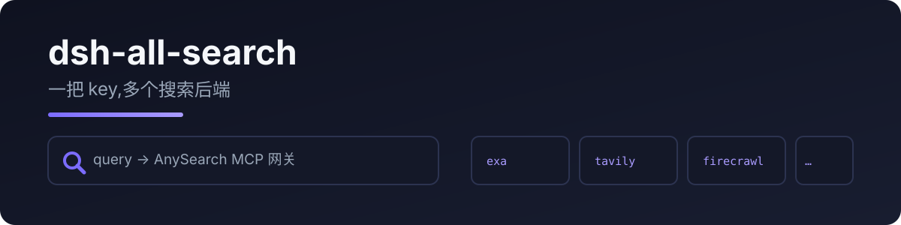

<p align="center">
  
</p>

# dsh-all-search

给 DeepSeek Harness 加一个 **AnySearch** 搜索 provider,注册进 `ctx.web`。AnySearch 是单 MCP 网关,一把 API key 聚合 exa / tavily / firecrawl / context7 等多家搜索。

配置了 api_key 时查询走 AnySearch 网关。没有 AnySearch key 时，同一个 anysearch provider 仍可用，改走 Firecrawl POST /v1/search，不带 Authorization（keyless）。若设置可选的 firecrawl_api_key，则发送 Authorization: Bearer 并使用你自己的配额。共享出口 IP 的 NAT/CI 会共用这份无 key 日额度。

> 由 [pi-all-search](https://github.com/RealAlexandreAI/pi-all-search) 移植。

[English](README.md) · [中文](README.zh.md)

## 为什么需要它

dsh 自带 Exa / Perplexity / DeepSeek 搜索。本插件补 AnySearch:一把 key 多个后端,不用为每家单独配凭据。

## 快速开始

```sh
dsh plugin --profile web add dsh-all-search
```

provider 以 `anysearch` 注册到 `ctx.web`,内置的 `web_search` 工具会自动识别,与自带 provider 并存。

```yaml
- id: all-search
  name: dsh-all-search
  config:
    api_key: <你的 anysearch key>   # 可选
```

| 键 | 必填 | 说明 |
|---|---|---|
| `api_key` | – | AnySearch key。配置后查询走 AnySearch 网关。 |
| `base_url` | – | MCP 端点覆盖 |
| `firecrawl_api_key` | – | 可选 Firecrawl key（Bearer 配额）。配置 AnySearch 时还启用 Developer Index 分支 |

没有 AnySearch key 时 provider 仍 available() = true，走 Firecrawl keyless。共享出口 IP 的 NAT/CI 会共用日额度；需要独立配额时设置 firecrawl_api_key。

## 隐私

- key 只存在于你的配置文件——不写日志
- 有 api_key 时只向 AnySearch 网关发送查询词和结果数量
- 没有 api_key 时查询发往 Firecrawl /v1/search

## 开发

```bash
npm install
npm run typecheck
npm test          # 结果解析 / maxResults / HTTP 错误 / keyless Firecrawl 路由
npm run build
```

真实搜索测试:

```bash
node --import tsx tests/real/real-search.mjs
```

## License

MIT
